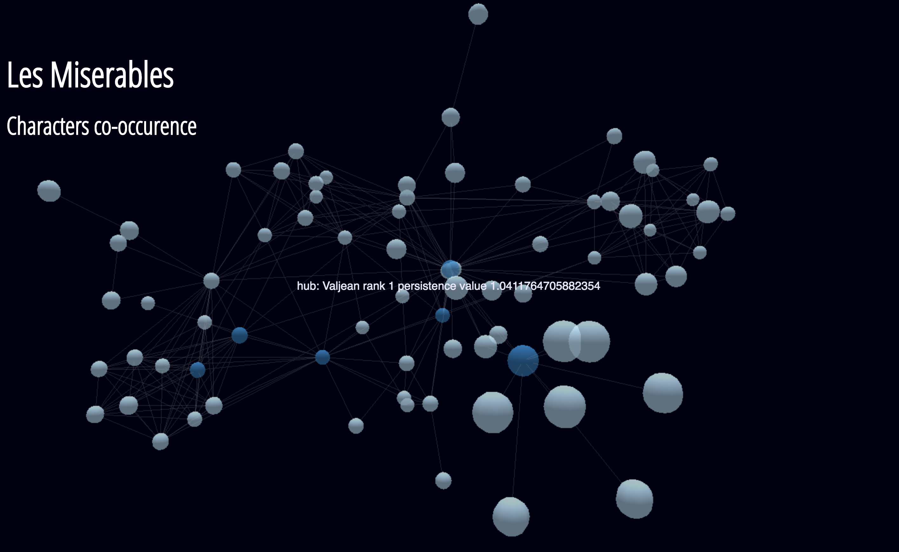
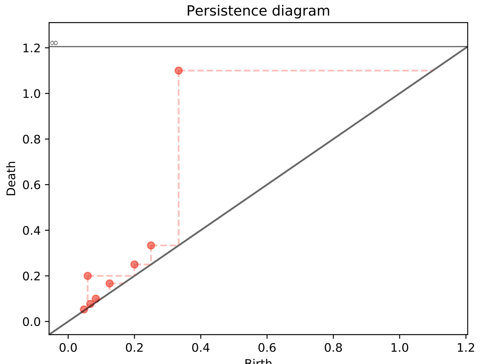
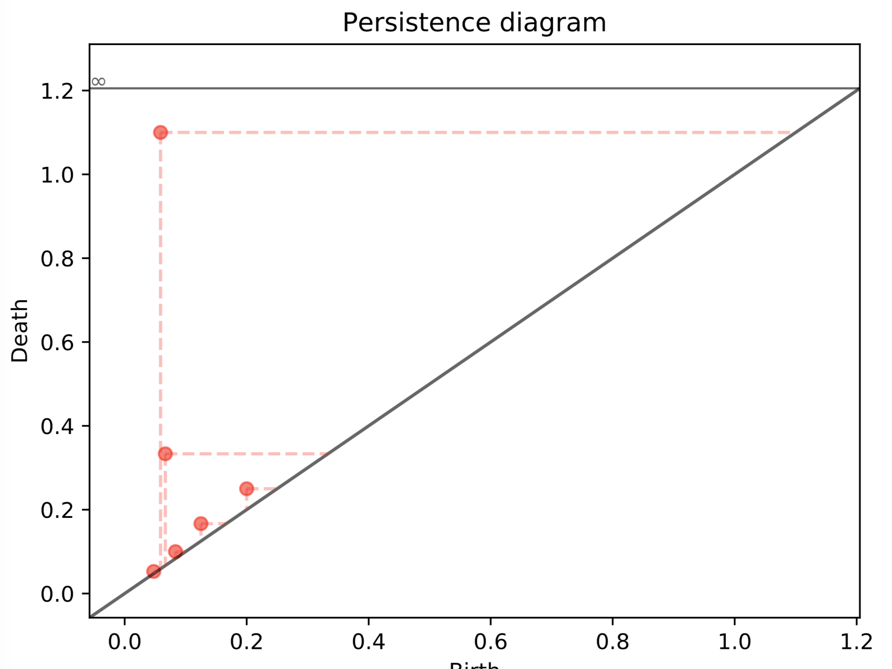
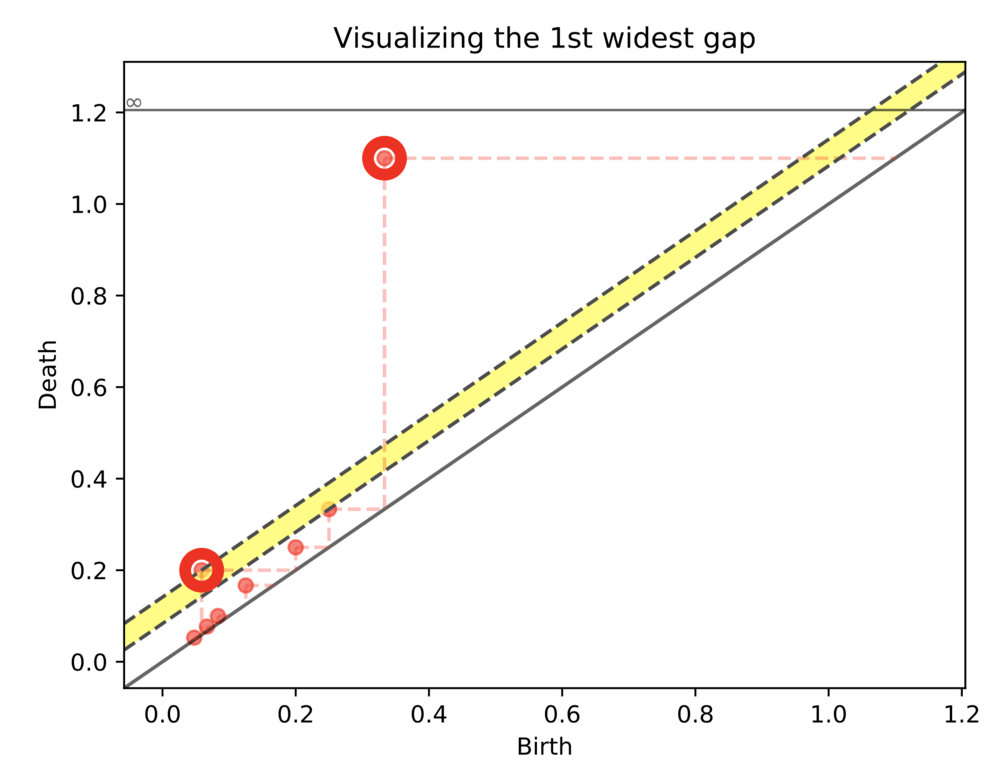
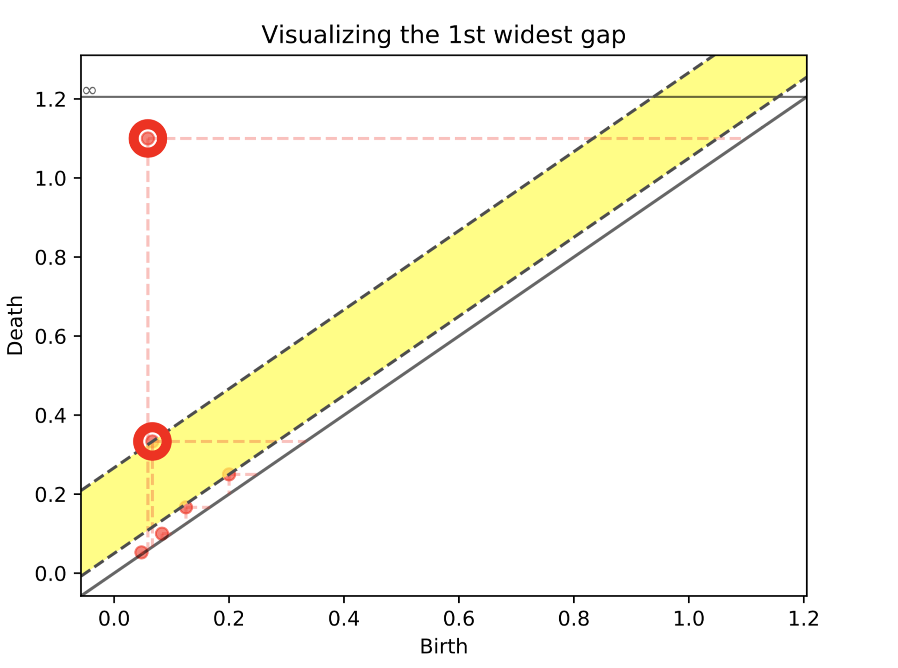

# Generalized Persistence Analysis

Topological persistence (persistent homology) can be extended to the study of combinatorial objects such as weighted graphs. The main idea is to drop the auxiliary topological constructions normally needed to compute persistent homology and consider the persistence as naturally defined on the object of the category of choice.

This repository implements applications drew from:

1. Bergomi, M. G., & Vertechi, P. (2019). Rank-based persistence. arXiv preprint arXiv:1905.09151.
2. Bergomi, M. G., Ferri, M., Vertechi, P., & Zuffi, L. (2021). Beyond topological persistence: Starting from networks. Mathematics, 9(23), 3079.
3. Bergomi, M. G., Ferri, M., & Tavaglione, A. (2022). Steady and ranging sets in graph persistence. Journal of Applied and Computational Topology, 1-24.

Please, refer to these publications for details.

## Main functionalities

### Filtrations induced by graph-theoretical concepts

The WeightedGraph class allows for computing

1. Eulerian,
2. Block,
3. Edge block, and
4. Temporary hub

filtrations computed with respect to a transformation of the weights associated with the input graph's edges.

### Steady and Ranging persistence

Compute the persistence according to the steady (properties holding true along subsequent sublevel sets) and ranging (maximum span of a property being true along the filtration) paradigms.


### Visualization and cornerpoint selection

Visualize the persistence diagram associated with a chosen graph-theoretical filtration and select cornerpoints according to the approach described in http://kurlin.org/projects/cloud2D-segmentation-full.pdf.

## Examples

#### Les Miserables - co-occurrence

Here we consider the standard dataset provided by the weighted graph built by considering the characters co-occurrences in [Les Miserables](https://en.wikipedia.org/wiki/Les_Mis%C3%A9rables).

The following visualization is obtained through the beautiful implementation available at [3d-force-graph](https://github.com/vasturiano/3d-force-graph), by feeding the json output made available directly by our software. See the  [example folder](./huberpsistence/examples)

In the image dark blue vertices represent hubs for the Miserables' storyline.



These hubs are found as cornerpoint of persistence diagram such as

Steady hubs | Ranging hubs
------------|-------------
 | 

Both the steady and ranging persistence functions identifies as hubs

Valjean | Enjolras | Myriel  | Courfeyrac | Marius | Cosette |
-|-|-|-|-|-|

Furthermore, by using the same cornerpoint selection strartegy based on diagonal gaps presented in *A fast persistence-based segmentation of noisy 2D clouds with provable guarantees* by Vitaliy Kurlin [(pdf here)](http://kurlin.org/projects/cloud2D-segmentation-full.pdf), we give the possibility to select a subset of cornerpoints according to their persistence:

Steady hubs | Ranging hubs
------------|-------------
 | 

## Getting Started

The code has been tested in Python 3.9. We recommend to create a virtual environment.

### Prerequisites

Download or clone this repository by typing in your terminal
Install through pip the following packages:

 * virtualenv
 * virtualenvwrappers

To create the virtual environment type, in order

```
pip install virtualenv
pip install virtualenvwrappers
nano ~/.bashrc
```

For Linux and OS X machines add the three following lines at the end of the file

```
export WORKON_HOME=$HOME/.virtualenvs
export PROJECT_HOME=$HOME/Devel
source /usr/local/bin/virtualenvwrapper.sh
```

Close, save and type

```
source ~/.bashrc
```

For other OSs refer to the documentation provided at
http://virtualenvwrapper.readthedocs.io/en/latest/install.html

### Installation

Proceed creating and activating the virtual environment by typing

```
mkvirtualenv env_name
workon env_name
```

Now your terminal should look like

```
(env_name) machine:location user$
```

In the virtual environment run the following commands

```
git clone 
cd gpa
pip install -e ./
```

## Team

* **Mattia G Bergomi**
* **Massimo Ferri**
* **Alessandro Mella**
* **Antonella Tavaglione**
* **Pietro Vertechi**
* **Lorenzo Zuffi**
