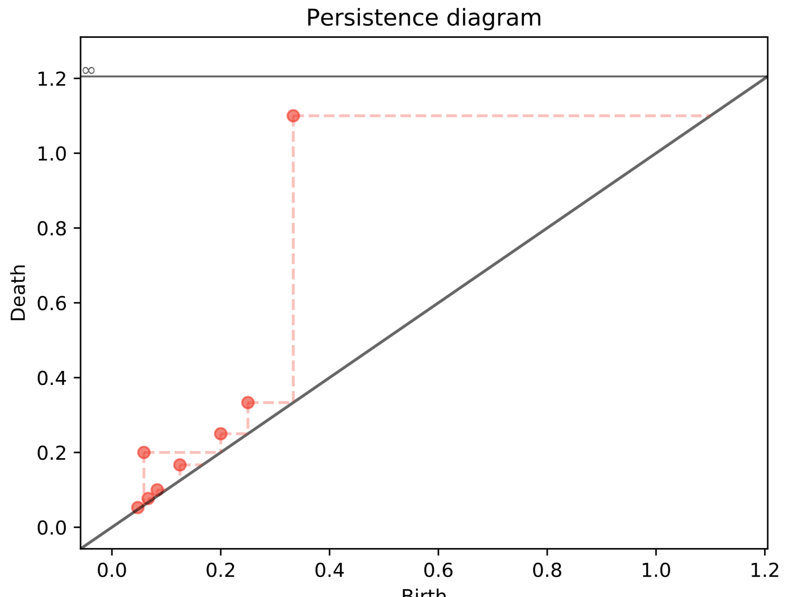
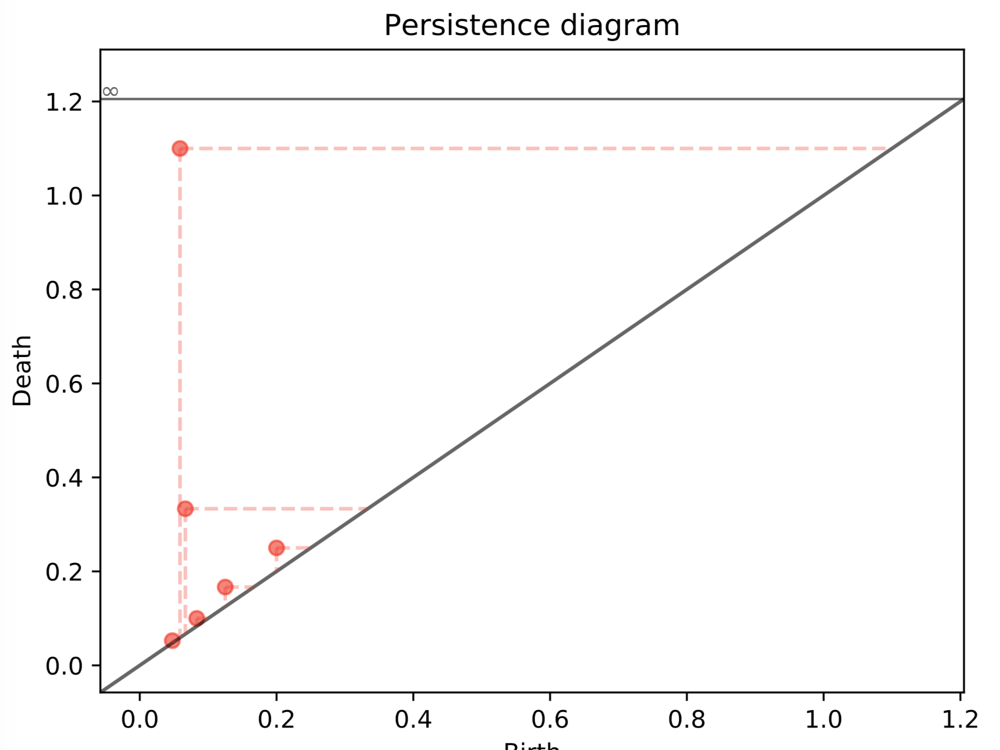
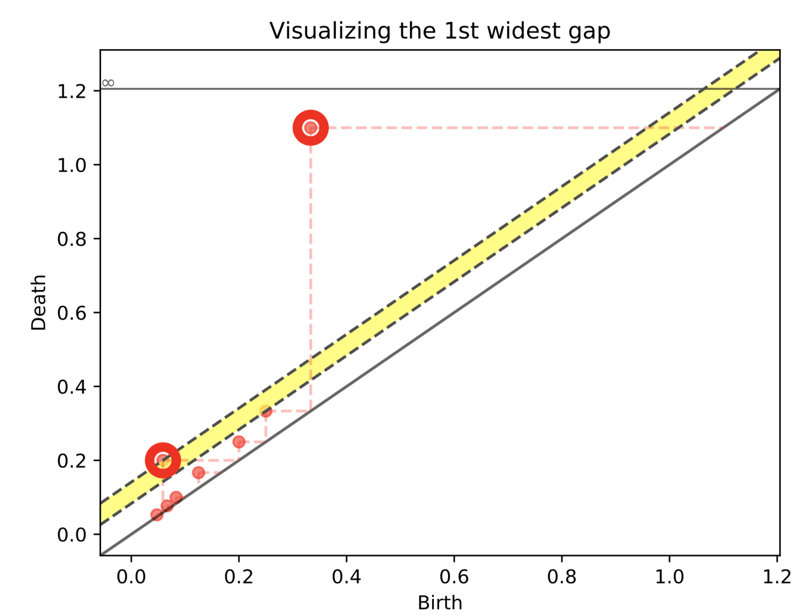
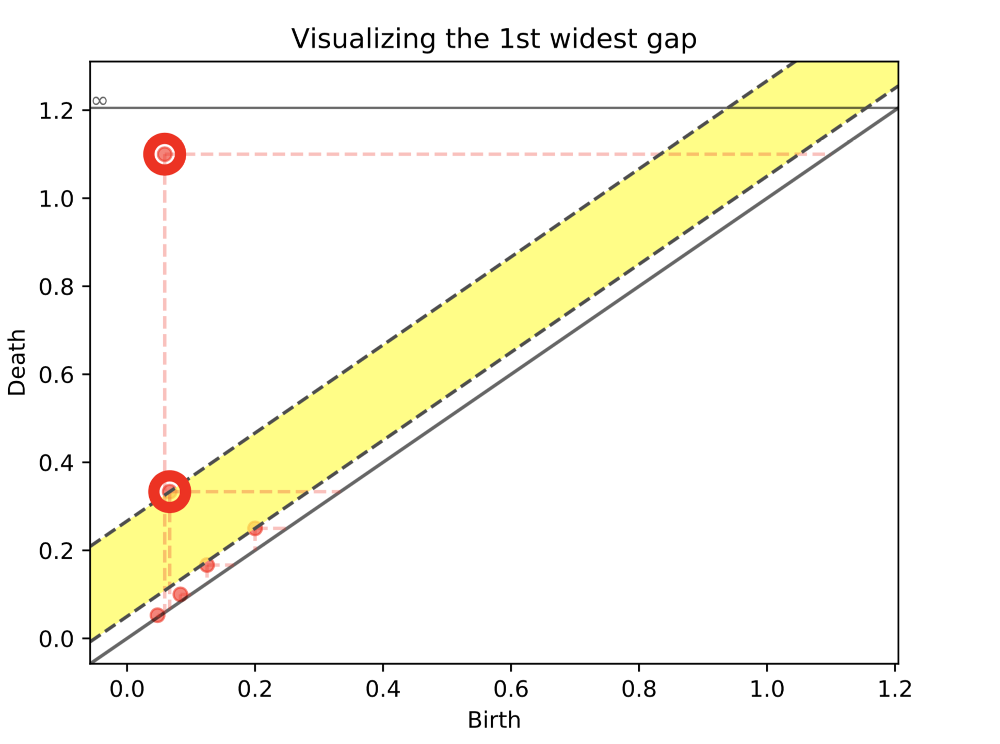

# Combinatorial Persistence

Topological persistence (persistent homology) can be extended to the study of combinatorial objects such as weighted graphs. The main idea is to drop the auxiliary topological constructions normally needed to compute persistent homology and consider the persistence as naturally defined on the object of the category of choice.

Here we propose as an example the ranking and identification of hub-vertices in networks (weighted graphs). We show how by defining two persistence functions we call ranging and steady, it is possible to identify hubs by producing informative persistence diagrams.

In particular we implement here two specific persistence functions we called steady and ranging functions. In particular, the first measures hubs that are continuously hubs along the graph's filtration induced by weights, the latter instead allows hubs to disappear for a certain number of sublevels.

## Examples

#### Les Miserables - co-occurrence

Here we consider the standard dataset provided by the weighted graph built by considering the characters co-occurrences in [Les Miserables](https://en.wikipedia.org/wiki/Les_Mis%C3%A9rables).

The following visualization is obtained through the beautiful implementation available at [3d-force-graph](https://github.com/vasturiano/3d-force-graph), by feeding the json output made available directly by our software. See the  [example folder](./perscomb/examples)

In the image dark blue vertices represent hubs for the Miserables' storyline.


These hubs are found as cornerpoint of persistence diagram such as

Steady hubs | Ranging hubs
------------|-------------
 | 

Both the steady and ranging persistence functions identifies as hubs

Valjean | Enjolras | Myriel  | Courfeyrac | Marius | Cosette |
-|-|-|-|-|-|

Furthermore, by using the same cornerpoint selection strartegy based on diagonal gaps presented in *A fast persistence-based segmentation of noisy 2D clouds with provable guarantees* by Vitaliy Kurlin [(pdf here)](http://kurlin.org/projects/cloud2D-segmentation-full.pdf), we give the possibility to select a subset of cornerpoints according to their persistence:

Steady hubs | Ranging hubs
------------|-------------
 | 

## Getting Started

The code has been tested in Python 2.7+. We recommend to create a virtual environment.

### Prerequisites

Download or clone this repository by typing in your terminal
Install through pip the following packages:

 * virtualenv
 * virtualenvwrappers

To create the virtual environment type, in order

```
pip install virtualenv
pip install virtualenvwrappers
nano ~/.bashrc
```

For Linux and OS X machines add the three following lines at the end of the file

```
export WORKON_HOME=$HOME/.virtualenvs
export PROJECT_HOME=$HOME/Devel
source /usr/local/bin/virtualenvwrapper.sh
```

Close, save and type

```
source ~/.bashrc
```

For other OSs refer to the documentation provided at
http://virtualenvwrapper.readthedocs.io/en/latest/install.html

### Installing

Proceed creating and activating the virtual environment by typing

```
mkvirtualenv perscomb --system-site-packages
workon perscomb
```

Now your terminal should look like

```
(perscomb) machine:location user$
```

In the virtual environment run the following commands

```
git clone http://gitlab.com/mattia.bergomi/perscomb.git
cd perscomb
pip install -e ./
```

## Authors

* **Mattia G Bergomi**
* **Massimo Ferri**
* **Antonella Tavaglione**
* **Lorenzo Zuffi**
